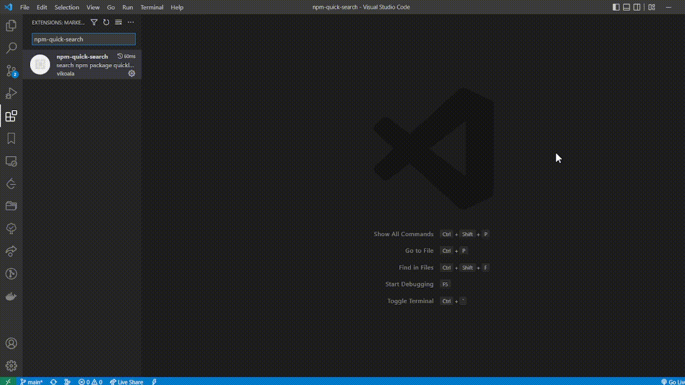
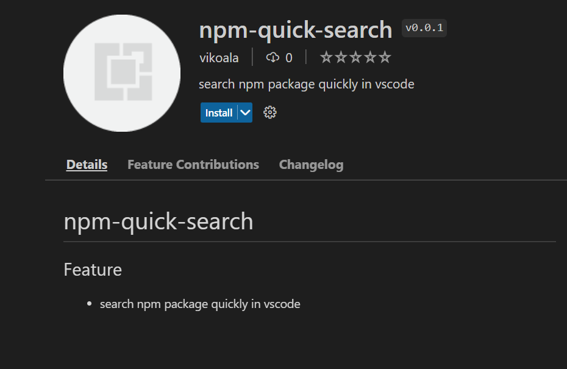

  

# npm-quick-search

## Feature

- search npm package quickly in vscode

## Install

install extension in vscode

## Usage

1. use `crtl + shift + p` open commands
2. input `search npm package`
3. input `package` keywords
4. select `package` and use `enter` open tab

